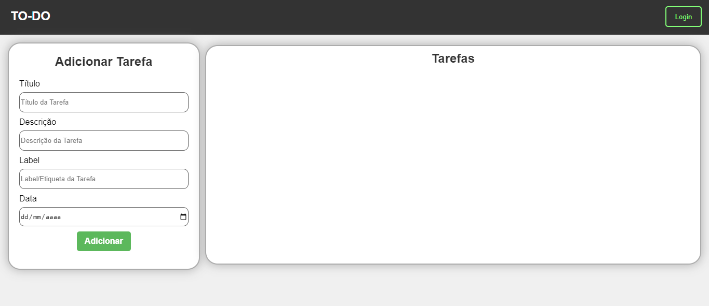

	

			<h2>🌐  To Do List - Trabalho WEB</h2>
	

	<h6>Trabalho apresentado como requisito para conclusão da disciplina de Programação para a WEB I, do curso de Análise e Desenvolvimento de Sistemas (2024.1), do Instituto Federal do Piauí - Campus Picos.</h6>
	<h2></h2>

  

    
  

  <h5>
    To Do List é um site feito com uso da API Auth0, que possibilita o usuário fazer login no sistema e ter acesso as tarefas adicionadas por ele.
  </h5>

